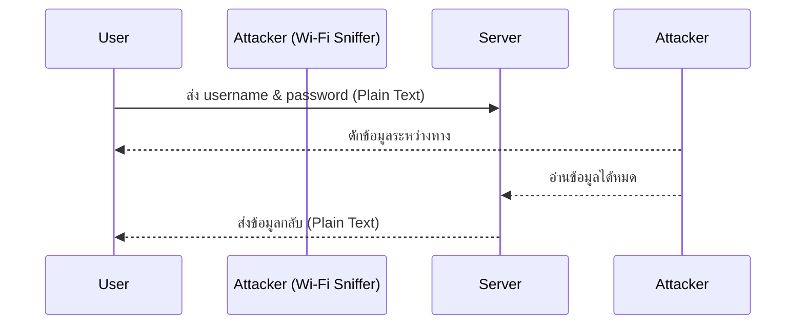
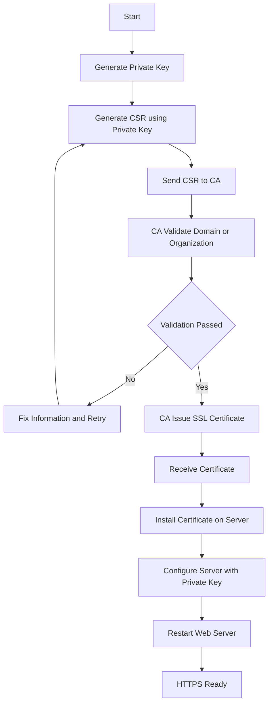
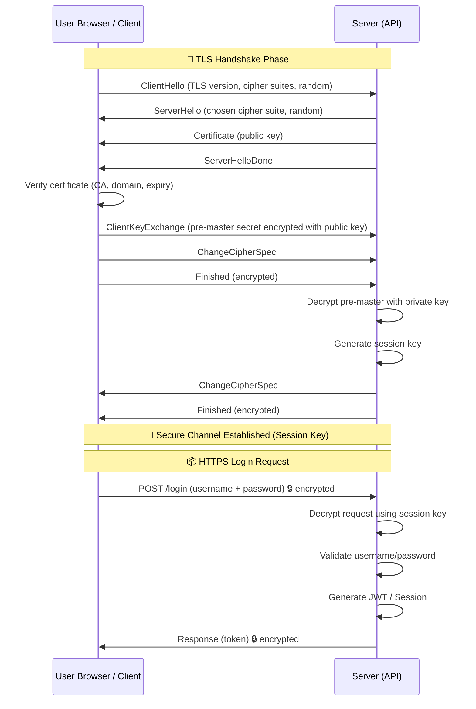
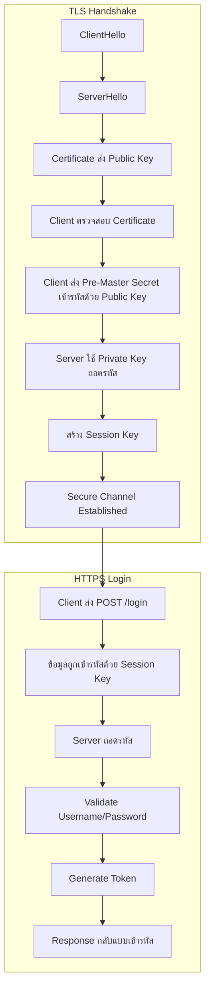
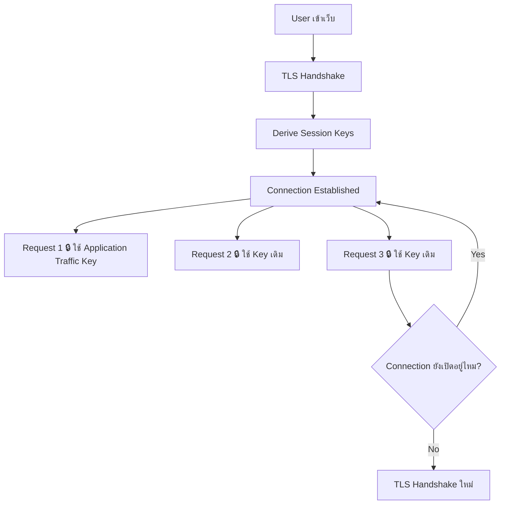

## SSL (Secure Sockets Layer) 

เป็นเทคโนโลยีเข้ารหัสข้อมูลรุ่นเก่า พัฒนาโดยบริษัท Netscape ในยุคแรกของอินเทอร์เน็ต ปัจจุบัน เลิกใช้แล้ว เพราะมีช่องโหว่ด้านความปลอดภัย แต่คนยังเรียกติดปากว่า “SSL” อยู่

## TLS (Transport Layer Security)

คือเวอร์ชันที่พัฒนาต่อจาก SSL ปลอดภัยกว่า และเป็นมาตรฐานที่ใช้จริงในปัจจุบัน

> เวลาเราเรียกว่า SSL Certificate จริง ๆ แล้วทางเทคนิคมันคือ TLS Certificate

## ตัวอย่างการใช้งาน ssl

เวลาคุณเข้าเว็บ:

```
http://example.com
```

ข้อมูลที่ส่งระหว่างคุณกับเว็บ อ่านได้หมด ใครดัก Wi-Fi ก็เห็น password ได้เลย



แต่ถ้าเป็น:

```
https://example.com
```

ข้อมูลจะถูก “เข้ารหัส”
ต่อให้มีคนดักอยู่กลางทางก็อ่านไม่ออก


## Terminology

### CA (Certificate Authority)

คือองค์กรที่ออกใบรับรอง (Certificate) ทำหน้าที่เหมือน “กรมการปกครองของอินเทอร์เน็ต” เวลาเว็บจะเปิด HTTPS ต้องไปขอใบรับรองจาก CA ก่อน
ตัวอย่าง CA ที่คนใช้กัน:
   - Let’s Encrypt
   - DigiCert
	- GlobalSign

CA ทำหน้าที่อะไร?
	1.	ตรวจสอบว่าโดเมนนี้เป็นของคุณจริงไหม
	2.	ออก Certificate ให้
	3.	เซ็นชื่อ (Digital Signature) ลงใน Certificate

ลายเซ็นของ CA คือสิ่งที่ browser ใช้ตรวจสอบความน่าเชื่อถือ

### CSR (Certificate Signing Request)

คือ “คำร้องขอใบรับรอง” ที่ Server ส่งไปให้ CA ก่อนที่ CA จะออก Certificate ให้
Server ต้องสร้างไฟล์ CSR ขึ้นมาก่อน
ข้างในมี:
   - Public Key
	- Domain (เช่น example.com)
	- ข้อมูล Organization (ถ้ามี)
	- ลายเซ็นดิจิทัลที่เซ็นด้วย Private Key

### Certificate

Certificate คือ “บัตรประชาชนของเว็บไซต์”
ข้างในมี:
   - Domain (เช่น example.com)
	- Public Key
	- ชื่อ CA ที่ออกให้
	- ลายเซ็นดิจิทัล
	- วันหมดอายุ

Browser จะใช้มันเพื่อตรวจสอบว่าเว็บนี้ของจริง

### TLS Handshake

ขั้นตอนที่ client กับ server:
	1.	ยืนยันตัวตน
	2.	สร้างกุญแจลับร่วมกัน
	3.	เริ่มเข้ารหัสข้อมูล

### Session Key

คือกุญแจลับที่ใช้เข้ารหัสข้อมูลจริง

ข้อดี:
	- เร็วมาก (ใช้ symmetric encryption เช่น AES)
	- สร้างใหม่ทุก connection

### Cipher Suite

คือชุด algorithm ที่ใช้ใน TLS เช่น:

```
TLS_AES_128_GCM_SHA256
```

บอกว่าใช้:
	- การเข้ารหัสแบบไหน (AES)
	- การทำ hash แบบไหน (SHA256)
	- การแลกเปลี่ยนกุญแจแบบไหน

### Private Key

   - กุญแจลับของ Server
	- ห้ามรั่วเด็ดขาด
	- ใช้พิสูจน์ตัวตน

### Public Key

	- ใส่อยู่ใน Certificate
	- แจกให้ client ได้
	- ใช้เข้ารหัสข้อมูลบางส่วนตอน handshake

### X.509

X.509 คือมาตรฐาน (standard) สำหรับ Digital Certificate
ที่ใช้ในระบบ SSL/TLS เพื่อยืนยันตัวตนของ Server หรือบุคคล/องค์กร

> สิ่งที่ทำให้ HTTPS ปลอดภัยก็คือ SSL/TLS

## File ที่เกี่ยวข้อง

ปกติเวลาที่ต้องการทำ ssl หรือ https เราจำเป็นต้องต้องมี 3 ส่วนดังต่อไปนี้

1. private.key (private key)
   - เป็นกุญแจลับของฝั่ง Server
   - ใช้ยืนยันตัวตนของ Server ในขั้นตอน TLS Handshake
   - ใช้ร่วมในการสร้าง/ถอดรหัส session key
	- **ห้ามเผยแพร่เด็ดขาด**
2. server.csr (CSR)
   ถูกสร้างจาก Private Key
	- มีข้อมูล:
      - Public Key
      - Domain / Organization
      - ลายเซ็นจาก Private Key
	- ใช้ส่งให้ CA เพื่อขอออก Certificate
	- ไฟล์นี้ไม่ใช่ความลับ สามารถส่งให้ CA ได้
3. cert.csr (cert)
   - เป็นไฟล์ที่ CA ออกให้
   - ภายในมี:
      - Public Key
      - ข้อมูลโดเมน
      - ลายเซ็นจาก CA
	- ใช้ให้ Client ตรวจสอบว่า Server เป็นของจริง
	- ใช้ในขั้นตอนแลกเปลี่ยนกุญแจระหว่าง Handshake

Self-sign คือ เราทำตัวเป็น​ CA

## ข้อมูลที่ต้องกรอกเพื่อใช้ในการสร้าง private key กับ public key (CSR)

| Field | ความหมาย | ตัวอย่าง | จำเป็นไหม |
|-------|-----------|----------|------------|
| Country Name (2 letter code) | รหัสประเทศตาม ISO 3166 | TH | จำเป็น |
| State or Province Name | จังหวัด / รัฐ (ชื่อเต็ม) | Bangkok | จำเป็น |
| Locality Name | เมือง / เขต | Chatuchak | ไม่เคร่งครัด |
| Organization Name | ชื่อบริษัทแบบเต็ม | Example Company Co., Ltd. | จำเป็น (สำคัญสำหรับ OV / EV) |
| Organizational Unit Name | ชื่อแผนก | IT Department | ไม่จำเป็น |
| Common Name | Domain ที่จะใช้กับ SSL | example.com | สำคัญมาก |
| Email Address | อีเมลติดต่อ | admin@example.com | ไม่จำเป็น |

## Flow การขอ cert



## Flow การทำงานของ TLS 




TLS Handshake จะเกิดตอน “สร้าง TLS connection ใหม่” หลังจากนั้น connection เดิมจะใช้ session key เดิม 

เกิดเมื่อ:
	- เปิด tab ใหม่
	- เปิด connection ใหม่
	- connection timeout
	- server ปิด connection
	- HTTP/1.1 ไม่มี keep-alive
	- load balancer เปลี่ยน backendจนกว่า connection จะถูกปิด




## Openssl command
```bash
# generate public key และ private key โดยที่ไม่ต้องระบบ passphrase
openssl req -newkey rsa:2048 -keyout private.key -out server.csr -nodes

# self sign cert
openssl x509 -req -in server.pem -signkey private.key -out cert.csr

# ดูข้อมูล crs
openssl x509 -in server.csr -text

# ดูข้อมูล cert
openssl x509 -in cert.csr -text
```
